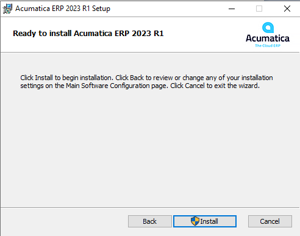
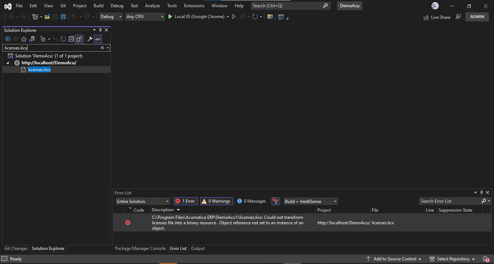

# Getting started
- [Go to Install Dev. Tool](#install-dev-tool)
   - [Acumatica Configuration](#acumatica-configuration)
   - [Visual Studio](#visual-studio)

# Install Dev. Tool

> ### **Acumatica Configuration**

1. download from https://openuni.acumatica.com/courses/a150-getting-started-with-acumatica-erp/

- select lastest version
  

2. next
   

3. select Following and next
   

4. next
   

5. install
   

6. finish
   

7. open Acumatica ERP Configuration > Deploy a Acumatica ERP Instance
   

8. login Sql Server and next
   

9. select database
   

10. next
    

11. login and next
    

12. next
    

13. next
    

14. finish
    

> ### **Visual Studio**

1. open visual studio (Run as Administrator)

   - https://visualstudio.microsoft.com/ (comunity version)

2. File > Open > Web Site
   

3. select instance(DemoAcu) and open
   

4. start without debugging (Ctrl + F5)
   
   debug (F5)
   

5. error license
   
   search > licenses.licx
   
   exclude from project
   

6. start application again
   
