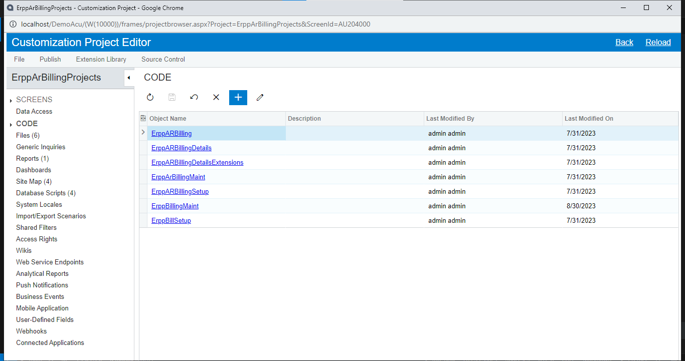
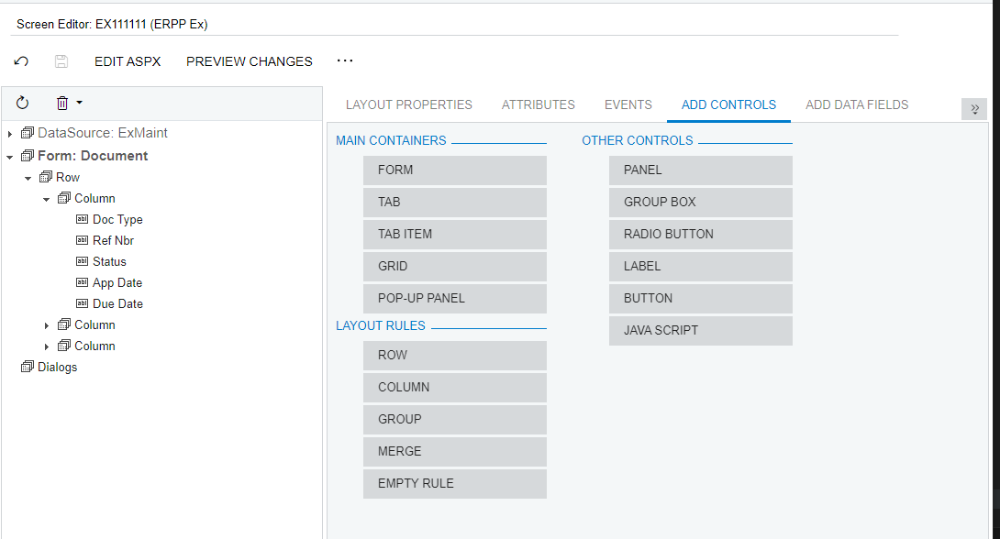
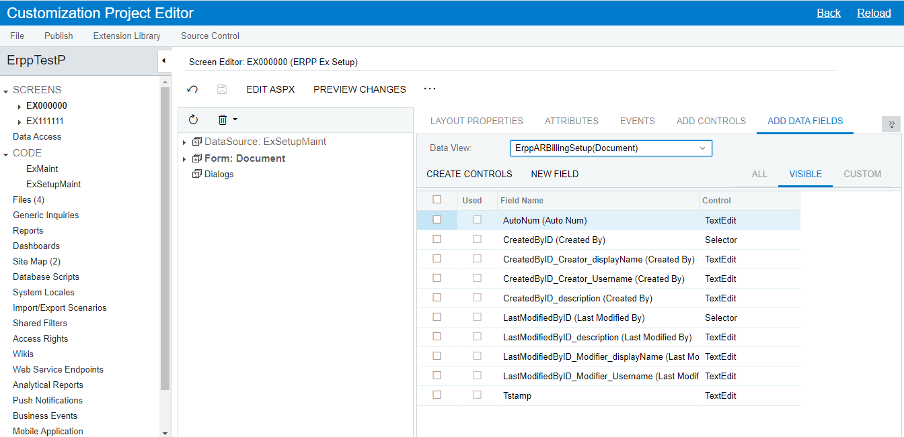
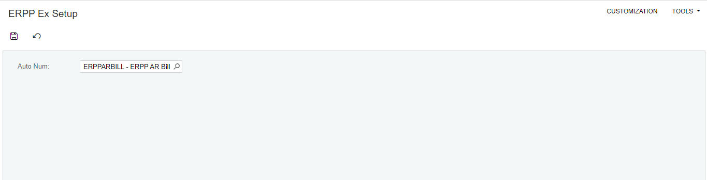

# Getting started
- [Go to Add Column From STD Form](#add-column-from-std-form)
   - [Add Column](#add-column)
- [Go to Action Componant](#action-componant)
   - [Action Data Change](#action-data-change)
   - [Calculete in this Form - Other Form](#calculete-in-this-form---other-form)
   - [Create Link Form](#create-link-form)
   - [Combo Box](#combo-box)
- [Go to New Form New Table + Sub Grid (2 table)](#new-form-new-table--sub-grid-2-table)
   - [New Table](#new-table)
   - [New DAC](#new-dac)
   - [New Form](#new-form)
   - [Auto Numbering](#auto-numbering)

# Add Column From STD Form

> ### **Add Column**

1. Customization Projects > Add Row > Project Name (ErppTestP) > Save
   
   

2. Customization Project Editor > Screens> Customize Existing Screen (Sales Orders ["SO.30.10.00"]) > Ok
   

3. Form > Add Data Fields > New Field
   

4. set properties > Ok
   
   เลือก custom จะเห็นฟิลล์ที่เพิ่มเข้ามา (ต้อง publish ก่อนถึงจะใช้ได้)
   

5. Publish > Publish Current Project
   
6. Add Controls > ลาก Column ไปที่ Form > Save
   
   

7. click new column > Add Data Fields > select Field > Create Controls > Save
   
   

8. Preview Changes
   
   

9. Publish > Publish Current Project

10. open screen
    
    

# Action Componant

> ### **Action Data Change**

1. Customize Business Logic
   
   

2. Publish > Publish Current Project
   
   เมื่อ published จะเห็นไฟล์ graph ที่โฟลเดอร์ App_RuntimeCode
   

3. สร้างคลาสสำหรับฟิลล์ใหม่ที่ namespaces เดียวกัน และเซ็ต Selector สำหรับเลือกข้อมูลจาก Customer

   ```C#
   public class SOOrderExt : PXCacheExtension<PX.Objects.SO.SOOrder>
   {
    #region UsrTest
    [PXDBString(50)]
    [PXUIField(DisplayName = "Test")]
    [PXSelector(typeof(Search<Customer.acctCD>),
        typeof(Customer.acctCD),
        typeof(Customer.acctName))]

    public virtual string UsrTest { get; set; }
    public abstract class usrTest : PX.Data.BQL.BqlString.Field<usrTest> { }
    #endregion
   }
   ```

4. สร้าง Events สำหรับช่อง usrTest เปลี่ยนค่า ให้ไปอัปเดตที่ช่อง Description (OrderDesc) ที่ Form (เซ็ต Commit Change = True ที่ฟิลล์ Event)

   ```C#
   protected virtual void _(Events.FieldUpdated<SOOrder, SOOrderExt.usrTest> e)
   {
    var row = e.Row;
    var rowExt = e.Cache.GetExtension<SOOrderExt>(row);

    if (!string.IsNullOrEmpty(rowExt.UsrTest))
    {
        row.OrderDesc = rowExt.UsrTest;
    }
   }
   ```

   

5. result
   
   

> ### **Calculete in this Form - Other Form**

1. สร้าง Events สำหรับ grid details เมื่อ RowInserted ให้เอาช่่อง Quatity ไปอัปเดตที่ช่อง Description (OrderDesc) ที่ Form

   ```C#
   protected virtual void _(Events.RowInserted<SOLine> e)
   {
    var row = e.Row;

    decimal? qty = Base.Transactions.Select().FirstTableItems
        .Select(x => x.OrderQty).Sum();

    Base.Document.Current.OrderDesc = qty.ToString();
   }
   ```

2. result
   
   

3. calculate from DAC (แก้โค้ดจากข้อ 1)

   ```C#
   protected virtual void _(Events.RowInserted<SOLine> e)
   {
    var row = e.Row;

    //decimal? qty = Base.Transactions.Select().FirstTableItems
    //    .Select(x => x.OrderQty).Sum();
    SOOrderEntry graph = PXGraph.CreateInstance<SOOrderEntry>();

    if (row.OrderQty != null)
    {
        decimal? qty = 0;
        foreach (POOrder obj in PXSelect<POOrder>.SelectWindowed(graph, 1, 1))
        {
            qty = +(obj.CuryLineTotal * obj.CuryOrderTotal);
        }

        Base.Document.Current.OrderDesc = qty.ToString();
    }
   }
   ```

> ### **Create Link Form**

1. following code:

   ```C#
   public PXAction<SOOrder> TestLink;
   [PXButton(CommitChanges = true)]
   [PXUIField(DisplayName = "Action to Me",
    MapEnableRights = PXCacheRights.Select,
    MapViewRights = PXCacheRights.Select, Enabled = true, Visible = true)]
   protected virtual IEnumerable testLink(PXAdapter adapter)
   {
    if (Base.Document.Current?.OrderNbr != null)
    {
        SOOrderEntry graph = PXGraph.CreateInstance<SOOrderEntry>();

        graph.Document.Current = PXSelectReadonly<SOOrder,
            Where<SOOrder.orderNbr, Equal<Required<SOOrder.orderNbr>>>>
            .Select(graph, Base.Document.Current.OrderNbr);

        if (graph.Document.Current != null)
        {
            PXRedirectHelper.TryRedirect(graph, PXRedirectHelper.WindowMode.NewWindow);
        }
    }

    return adapter.Get();
   }
   ```

2. result
   

> ### **Combo Box**

- Fix Data

  1.  UsrTest Field (delete userTest component)
      

  2.  Edit Dac

      ```C#
      [PXDBString(50)]
      [PXUIField(DisplayName = "Test")]
      //[PXSelector(typeof(Search<Customer.acctCD>),
      //    typeof(Customer.acctCD),
      //    typeof(Customer.acctName))]
      [PXStringList(new string[] { "H", "B" }, new string[] { "Hold", "Balanch" })]
      public virtual string UsrTest { get; set; }
      public abstract class usrTest : PX.Data.BQL.BqlString.Field<usrTest> { }
      ```

  3.  result
      

# New Form New Table + Sub Grid (2 table)

> ### **New Table**

1. Customization Project > Customization Project Editor > Database Script > Add Script
   
   (Example Script)

   - Parent Table

     ```SQL
     IF (NOT EXISTS (SELECT * FROM INFORMATION_SCHEMA.TABLES WHERE TABLE_SCHEMA = 'dbo' AND TABLE_NAME = 'ErppARBilling'))
     BEGIN
        CREATE TABLE [dbo].[ErppARBilling](
           CompanyID int NOT NULL,
           DocType nvarchar(3) NOT NULL,
           RefNbr nvarchar(10) NOT NULL,
           Status nvarchar(1) NOT NULL,
           AppDate datetime NOT NULL,
           DueDate datetime NOT NULL,
           CustomerID int NOT NULL,
           TermID nvarchar(20) NOT NULL,
           CuryID nvarchar(10) NOT NULL,
           DocDes nvarchar(200),
           CuryApplAmt decimal(9,2),
           CuryUnappliedBal decimal(9,2),

           CreatedByID uniqueidentifier NOT NULL,
           CreatedByScreenID char(8) NOT NULL,
           CreatedDateTime datetime NOT NULL,
           LastModifiedByID uniqueidentifier NOT NULL,
           LastModifiedByScreenID char(8) NOT NULL,
           LastModifiedDateTime datetime NOT NULL,
           tstamp timestamp NOT NULL

           constraint pk_ErppARBilling primary key(
              CompanyID,
              RefNbr
           )
        )
     END
     ```

   - child table

     ```SQL
     IF (NOT EXISTS (SELECT * FROM INFORMATION_SCHEMA.TABLES WHERE TABLE_SCHEMA = 'dbo' AND TABLE_NAME = 'ErppARBillingDetails'))
        BEGIN
           CREATE TABLE [dbo].[ErppARBillingDetails](
              CompanyID int NOT NULL,
              BillingID nvarchar(10),
              DocType nvarchar(3) NOT NULL,
              RefNbr nvarchar(10) NOT NULL,
              LineNbr int NOT NULL,
              Date datetime NOT NULL,
              DueDate datetime NOT NULL,
              CustomerID int NOT NULL,
              CuryApplAmt decimal(9,2),
              CuryApplAmtTotal decimal(9,2),

              CreatedByID uniqueidentifier NOT NULL,
              CreatedByScreenID char(8) NOT NULL,
              CreatedDateTime datetime NOT NULL,
              LastModifiedByID uniqueidentifier NOT NULL,
              LastModifiedByScreenID char(8) NOT NULL,
              LastModifiedDateTime datetime NOT NULL,
              tstamp timestamp NOT NULL

              constraint pk_ErppARBillingDetails primary key(
                 CompanyID,
                 BillingID,
                 DocType,
                 RefNbr,
                 LineNbr
              )
           )
        END
     ```

   Specify Database Engine > Ok
   

2. Publish > Publish Current Project

> ### **New DAC**

1. Customization Project > Customization Project Editor > Code > Add New Record
   

2. generate new dac

   - template -> New DAC
   - class name -> Table Name
   - Generate Members from Database -> True
     

   ```C#
   using System;
   using PX.Data;

   namespace ErppTestP
   {
      [Serializable]
      [PXCacheName("ErppARBilling")]
      public class ErppARBilling : IBqlTable
      {
         #region DocType
         [PXDBString(3, IsKey = true, IsUnicode = true, InputMask = "")]
         [PXUIField(DisplayName = "Doc Type")]
         public virtual string DocType { get; set; }
         public abstract class docType : PX.Data.BQL.BqlString.Field<docType> { }
         #endregion

         #region RefNbr
         [PXDBString(10, IsKey = true, IsUnicode = true, InputMask = "")]
         [PXUIField(DisplayName = "Ref Nbr")]
         public virtual string RefNbr { get; set; }
         public abstract class refNbr : PX.Data.BQL.BqlString.Field<refNbr> { }
         #endregion

         #region Status
         [PXDBString(1, IsUnicode = true, InputMask = "")]
         [PXUIField(DisplayName = "Status")]
         public virtual string Status { get; set; }
         public abstract class status : PX.Data.BQL.BqlString.Field<status> { }
         #endregion

         #region AppDate
         [PXDBDate()]
         [PXUIField(DisplayName = "App Date")]
         public virtual DateTime? AppDate { get; set; }
         public abstract class appDate : PX.Data.BQL.BqlDateTime.Field<appDate> { }
         #endregion

         #region DueDate
         [PXDBDate()]
         [PXUIField(DisplayName = "Due Date")]
         public virtual DateTime? DueDate { get; set; }
         public abstract class dueDate : PX.Data.BQL.BqlDateTime.Field<dueDate> { }
         #endregion

         #region CustomerID
         [PXDBInt()]
         [PXUIField(DisplayName = "Customer ID")]
         public virtual int? CustomerID { get; set; }
         public abstract class customerID : PX.Data.BQL.BqlInt.Field<customerID> { }
         #endregion

         #region Termid
         [PXDBString(20, IsUnicode = true, InputMask = "")]
         [PXUIField(DisplayName = "Termid")]
         public virtual string Termid { get; set; }
         public abstract class termid : PX.Data.BQL.BqlString.Field<termid> { }
         #endregion

         #region Curyid
         [PXDBString(10, IsUnicode = true, InputMask = "")]
         [PXUIField(DisplayName = "Curyid")]
         public virtual string Curyid { get; set; }
         public abstract class curyid : PX.Data.BQL.BqlString.Field<curyid> { }
         #endregion

         #region DocDes
         [PXDBString(200, IsUnicode = true, InputMask = "")]
         [PXUIField(DisplayName = "Doc Des")]
         public virtual string DocDes { get; set; }
         public abstract class docDes : PX.Data.BQL.BqlString.Field<docDes> { }
         #endregion

         #region CuryApplAmt
         [PXDBDecimal()]
         [PXUIField(DisplayName = "Cury Appl Amt")]
         public virtual Decimal? CuryApplAmt { get; set; }
         public abstract class curyApplAmt : PX.Data.BQL.BqlDecimal.Field<curyApplAmt> { }
         #endregion

         #region CuryUnappliedBal
         [PXDBDecimal()]
         [PXUIField(DisplayName = "Cury Unapplied Bal")]
         public virtual Decimal? CuryUnappliedBal { get; set; }
         public abstract class curyUnappliedBal : PX.Data.BQL.BqlDecimal.Field<curyUnappliedBal> { }
         #endregion

         #region CreatedByID
         [PXDBCreatedByID()]
         public virtual Guid? CreatedByID { get; set; }
         public abstract class createdByID : PX.Data.BQL.BqlGuid.Field<createdByID> { }
         #endregion

         #region CreatedByScreenID
         [PXDBCreatedByScreenID()]
         public virtual string CreatedByScreenID { get; set; }
         public abstract class createdByScreenID : PX.Data.BQL.BqlString.Field<createdByScreenID> { }
         #endregion

         #region CreatedDateTime
         [PXDBCreatedDateTime()]
         public virtual DateTime? CreatedDateTime { get; set; }
         public abstract class createdDateTime : PX.Data.BQL.BqlDateTime.Field<createdDateTime> { }
         #endregion

         #region LastModifiedByID
         [PXDBLastModifiedByID()]
         public virtual Guid? LastModifiedByID { get; set; }
         public abstract class lastModifiedByID : PX.Data.BQL.BqlGuid.Field<lastModifiedByID> { }
         #endregion

         #region LastModifiedByScreenID
         [PXDBLastModifiedByScreenID()]
         public virtual string LastModifiedByScreenID { get; set; }
         public abstract class lastModifiedByScreenID : PX.Data.BQL.BqlString.Field<lastModifiedByScreenID> { }
         #endregion

         #region LastModifiedDateTime
         [PXDBLastModifiedDateTime()]
         public virtual DateTime? LastModifiedDateTime { get; set; }
         public abstract class lastModifiedDateTime : PX.Data.BQL.BqlDateTime.Field<lastModifiedDateTime> { }
         #endregion

         #region Tstamp
         [PXDBTimestamp()]
         [PXUIField(DisplayName = "Tstamp")]
         public virtual byte[] Tstamp { get; set; }
         public abstract class tstamp : PX.Data.BQL.BqlByteArray.Field<tstamp> { }
         #endregion
      }
   }
   ```

3. Publish > Publish Current Project

> ### **New Form**

1. Customization Project > Customization Project Editor > Screens > Create New Screen
   

2. generate new screen

   - Screen ID
   - Graph Name (Business Logic Area)
   - Graph Namespace (Default)
   - Page Title
   - Template -> Form (FormView)
     

     ```C#
     using System;
     using PX.Data;

     namespace ErppTestP
     {
        public class ExMaint : PXGraph<ExMaint>
        {

           public PXSave<MasterTable> Save;
           public PXCancel<MasterTable> Cancel;


           public PXFilter<MasterTable> MasterView;
           public PXFilter<DetailsTable> DetailsView;

           [Serializable]
           public class MasterTable : IBqlTable
           {

           }

           [Serializable]
           public class DetailsTable : IBqlTable
           {

           }
        }
     }
     ```

3. Publish > Publish Current Project
   

4. ExMaint (Business Logic Area) -> Create View

   - Document -> View Name

   ```C#
   public SelectFrom<ErppARBilling>.View Document;

   public PXSave<ErppARBilling> Save;
   public PXCancel<ErppARBilling> Cancel;
   ```

5. Publish > Publish Current Project

6. set view for components

   - DataSource -> PrimaryView -> View Name (Document) -> Save
     
   - Form -> DataMember -> View Name (Document) -> Save
     

7. result
   

8. create controls
   
   

9. Publish > Publish Current Project
   

10. layout
    
    

11. create view details

    - DAC

      ```C#
      #region BillingID
      [PXDBString(10, IsKey = true, IsUnicode = true, InputMask = "")]
      [PXUIField(DisplayName = "Billing ID")]
      [PXDBDefault(typeof(ErppARBilling.refNbr))]
      [PXParent(typeof(Select<ErppARBilling,
         Where<ErppARBilling.refNbr, Equal<Current<billingID>>>>))]
      public virtual string BillingID { get; set; }
      public abstract class billingID : PX.Data.BQL.BqlString.Field<billingID> { }
      #endregion
      ```

    - View
      ```C#
      // Setup details view
      public PXSelect<ErppARBilling,
         Where<ErppARBilling.refNbr,
            Equal<Current<ErppARBillingDetails.billingID>>>> CurrentDocument;
      public PXSelect<ErppARBillingDetails,
         Where<ErppARBillingDetails.billingID,
            Equal<Current<ErppARBilling.refNbr>>>> Transaction;
      ```

12. Publish > Publish Current Project

13. add controls
    

14. setup controls
    
    

    - AutoAdjustColumns -> True
    - DataMember -> Transaction
    - Height -> 200px
    - Skin ID -> DetailsInTab
    - Width -> 100%
    - SyncPosition -> True
      

15. result
    

> ### **Auto Numbering**

1. Numbering Sequences > Add New Record
   

2. create Table for Auto Numbering

   ```SQL
   IF (NOT EXISTS (SELECT * FROM INFORMATION_SCHEMA.TABLES WHERE TABLE_SCHEMA = 'dbo' AND TABLE_NAME = 'ErppARBillingSetup'))
   BEGIN
   	CREATE TABLE [dbo].[ErppARBillingSetup](
   		AutoNumID int IDENTITY(1,1) primary key,
   		AutoNum nvarchar(10) NOT NULL,

   		CreatedByID uniqueidentifier NOT NULL,
   		CreatedByScreenID char(8) NOT NULL,
   		CreatedDateTime datetime NOT NULL,
   		LastModifiedByID uniqueidentifier NOT NULL,
   		LastModifiedByScreenID char(8) NOT NULL,
   		LastModifiedDateTime datetime NOT NULL,
   		tstamp timestamp NOT NULL
   	)
   END
   ```

3. create dac
   

   ```C#
   [Serializable]
   [PXCacheName("ErppARBillingSetup")]
   public class ErppARBillingSetup : IBqlTable
   {
      #region AutoNumID
      [PXDBIdentity(IsKey = true)]
      public virtual int? AutoNumID { get; set; }
      public abstract class autoNumID : PX.Data.BQL.BqlInt.Field<autoNumID> { }
      #endregion

      #region AutoNum
      [PXDBString(10, IsUnicode = true, InputMask = "")]
      [PXUIField(DisplayName = "Auto Num")]
      public virtual string AutoNum { get; set; }
      public abstract class autoNum : PX.Data.BQL.BqlString.Field<autoNum> { }
      #endregion

      #region CreatedByID
      [PXDBCreatedByID()]
      public virtual Guid? CreatedByID { get; set; }
      public abstract class createdByID : PX.Data.BQL.BqlGuid.Field<createdByID> { }
      #endregion

      #region CreatedByScreenID
      [PXDBCreatedByScreenID()]
      public virtual string CreatedByScreenID { get; set; }
      public abstract class createdByScreenID : PX.Data.BQL.BqlString.Field<createdByScreenID> { }
      #endregion

      #region CreatedDateTime
      [PXDBCreatedDateTime()]
      public virtual DateTime? CreatedDateTime { get; set; }
      public abstract class createdDateTime : PX.Data.BQL.BqlDateTime.Field<createdDateTime> { }
      #endregion

      #region LastModifiedByID
      [PXDBLastModifiedByID()]
      public virtual Guid? LastModifiedByID { get; set; }
      public abstract class lastModifiedByID : PX.Data.BQL.BqlGuid.Field<lastModifiedByID> { }
      #endregion

      #region LastModifiedByScreenID
      [PXDBLastModifiedByScreenID()]
      public virtual string LastModifiedByScreenID { get; set; }
      public abstract class lastModifiedByScreenID : PX.Data.BQL.BqlString.Field<lastModifiedByScreenID> { }
      #endregion

      #region LastModifiedDateTime
      [PXDBLastModifiedDateTime()]
      public virtual DateTime? LastModifiedDateTime { get; set; }
      public abstract class lastModifiedDateTime : PX.Data.BQL.BqlDateTime.Field<lastModifiedDateTime> { }
      #endregion

      #region Tstamp
      [PXDBTimestamp()]
      [PXUIField(DisplayName = "Tstamp")]
      public virtual byte[] Tstamp { get; set; }
      public abstract class tstamp : PX.Data.BQL.BqlByteArray.Field<tstamp> { }
      #endregion
   }
   ```

4. Publish > Publish Curreent Project

5. create form setup
   

6. Publish > Publish Curreent Project

7. create view

   ```C#
   public PXSelect<ErppARBillingSetup> Document;

   public PXSave<ErppARBillingSetup> Save;
   public PXCancel<ErppARBillingSetup> Cancel;
   ```

   

8. set selector attribute

   ```C#
   #region AutoNum
   [PXDBString(10, IsUnicode = true, InputMask = "")]
   [PXUIField(DisplayName = "Auto Num")]
   [PXSelector(typeof(Search<Numbering.numberingID>),
      DescriptionField = typeof(Numbering.descr))]
   public virtual string AutoNum { get; set; }
   public abstract class autoNum : PX.Data.BQL.BqlString.Field<autoNum> { }
   #endregion
   ```

   

9. Publish > Publish Curreent Project

10. save numbering name
    
    

11. setup main form

- DAC
  ```C#
  #region RefNbr
  [PXDBString(10, IsKey = true, IsUnicode = true, InputMask = "")]
  [PXUIField(DisplayName = "Ref Nbr")]
  [PXDefault(PersistingCheck = PXPersistingCheck.NullOrBlank)]
  [AutoNumber(typeof(ErppARBillingSetup.autoNum), typeof(AccessInfo.businessDate))]
  public virtual string RefNbr { get; set; }
  public abstract class refNbr : PX.Data.BQL.BqlString.Field<refNbr> { }
  #endregion
  ```
- View
  ```C#
  public PXSetup<ErppARBillingSetup> DocumentSetUp;
  public SelectFrom<ErppARBilling>.View Document;
  ```
- Event RowPersisting (จังหวะกำลังเซฟ)
  ```C#
  #region Document Events RowPersisting
  protected virtual void _(Events.RowPersisting<ErppARBilling> e)
  {
     ErppARBilling row = e.Row;
     if (row != null)
     {
        AutoNumberAttribute.SetNumberingId<ErppARBilling.refNbr>(e.Cache, "ERPPARBILL");
     }
  }
  #endregion
  ```

12. Publish > Publish Curreent Project

13. result
    
