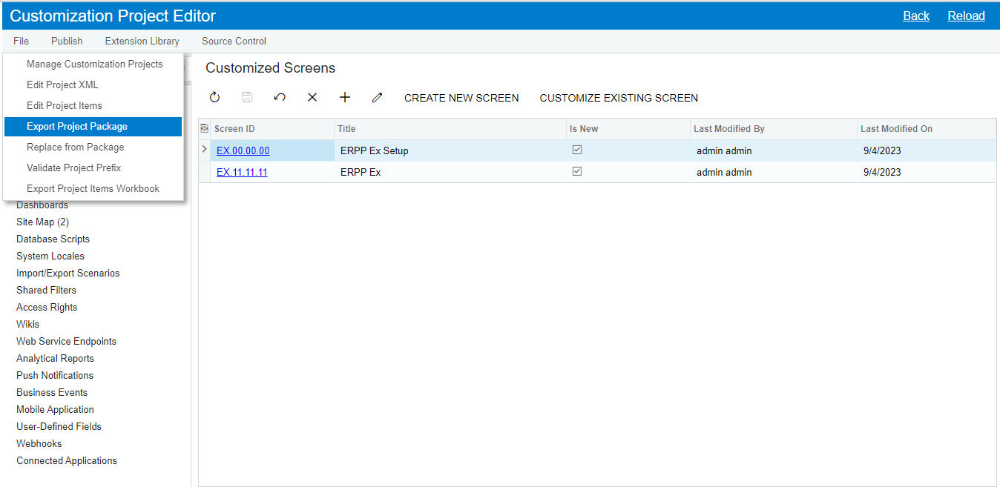
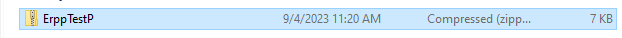
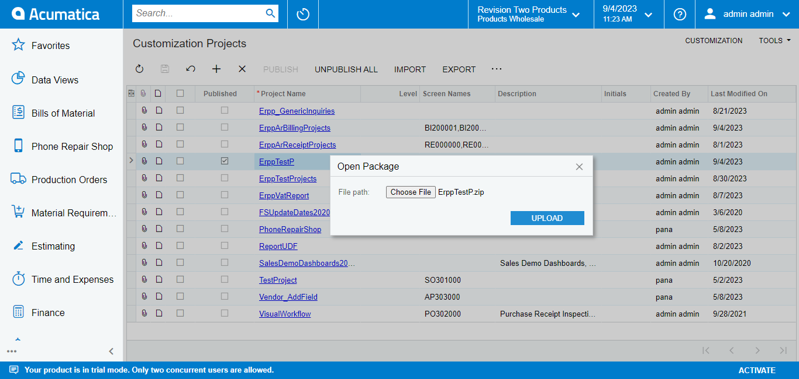

# How to back up and Install Program To Production Server

> ### **Back up**

1. Customization Projects > Customization Project Editor

2. File > Export Project Package
  
  

> ### **Install Program**

1. Customization Projects > Import > Choose File Project > Upload
  

2. Customization Projects > Customization Project Editor > Publish > Publish Current Project