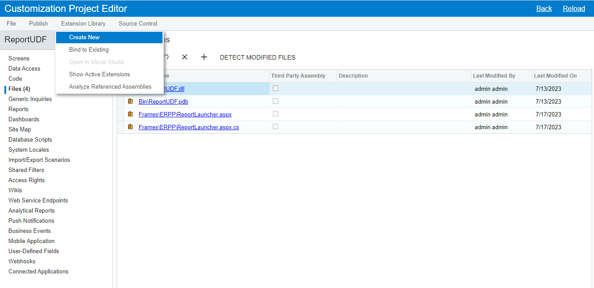
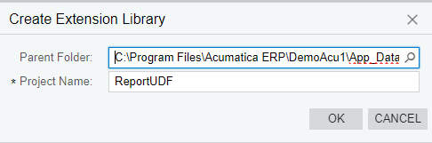
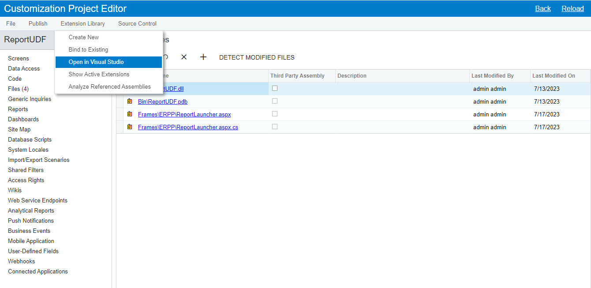
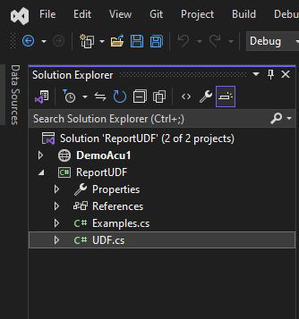
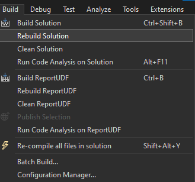
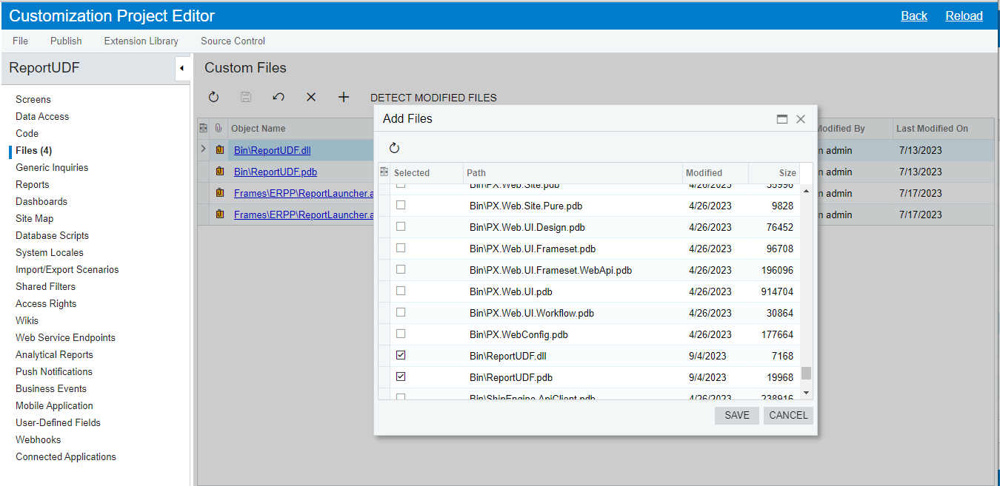
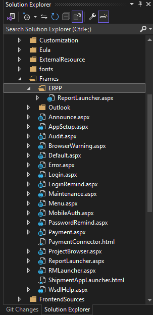
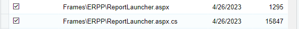
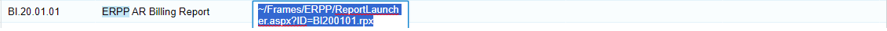
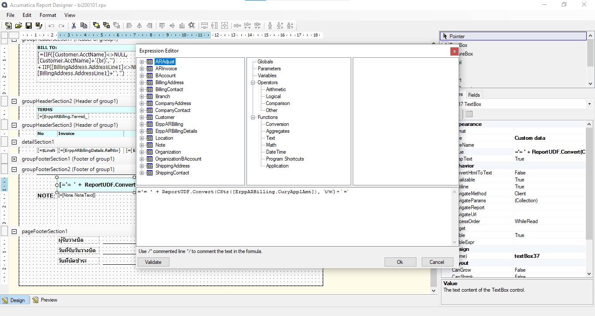

# Extension Library

1. Customization Projects > Customization Project Editor > Extension Library > Create New
  
  

2. open in visual studio
  

3. create a new class (UDF)
  
  - Example code
    ```C#
    #region Check_Num
    protected string Check_Num(string Number)
    {
        int number = Int32.Parse(Number);
        string word = "";
        switch (number)
        {
            case 1:
                word = "หนึ่ง";
                break;
            case 2:
                word = "สอง";
                break;
            case 3:
                word = "สาม";
                break;
            case 4:
                word = "สี่";
                break;
            case 5:
                word = "ห้า";
                break;
            case 6:
                word = "หก";
                break;
            case 7:
                word = "เจ็ด";
                break;
            case 8:
                word = "แปด";
                break;
            case 9:
                word = "เก้า";
                break;
        }

        return word;
    }
    #endregion

    #region Check_Len
    protected string Check_Len(int Index)
    {
        string word = "";
        switch (Index)
        {
            case 1:
                word = "";
                break;
            case 2:
                word = "สิบ";
                break;
            case 3:
                word = "ร้อย";
                break;
            case 4:
                word = "พัน";
                break;
            case 5:
                word = "หมื่น";
                break;
            case 6:
                word = "แสน";
                break;
            case 7:
                word = "ล้าน";
                break;
        }

        return word;
    }
    #endregion

    #region Check_Dec
    protected string Check_Dec(string Number)
    {
        int number = Int32.Parse(Number);
        string word = "";
        switch (number)
        {
            case 0:
                word = "ศูนย์";
                break;
            case 1:
                word = "หนึ่ง";
                break;
            case 2:
                word = "สอง";
                break;
            case 3:
                word = "สาม";
                break;
            case 4:
                word = "สี่";
                break;
            case 5:
                word = "ห้า";
                break;
            case 6:
                word = "หก";
                break;
            case 7:
                word = "เจ็ด";
                break;
            case 8:
                word = "แปด";
                break;
            case 9:
                word = "เก้า";
                break;
        }

        return word;
    }
    #endregion

    #region Convert
    public string Convert(string amount, string cury = null)
    {
        string amountWord = "";
        string f = amount.Split('.')[0].ToString().Replace(",", "");
        string b = amount.Split('.')[1].ToString();
        for (int i = 0; i <= f.Length - 1; i++)
        {
            if (f[i].ToString() == "0") continue;
            amountWord += Check_Num(f[i].ToString()) + Check_Len(f.Length - i);
        }
        if (amount.IndexOf('.') != -1 && (b[0] != '0' || b[1] != '0'))
        {
            amountWord += "จุด";
            for (int i = 0; i <= b.Length - 1; i++)
            {
                if (b[1] == '0') break;
                amountWord += Check_Dec(b[i].ToString());
            }
            amountWord += cury;
        }
        else amountWord += cury != null ? cury + "ถ้วน" : "ถ้วน";

        return amountWord;
    }
    #endregion

    #region Return Char
    public char? ReturnChar(string word, int index)
    {
        try
        {
            char[] result = word.ToCharArray();

            return result[index];
        }
        catch (IndexOutOfRangeException)
        {
            return null;
        }
    }
    #endregion
    ```

4. Build > Rebuild Solution
  

5. Customization Projects > Customization Project Editor > Files > Add New Record > Save
  

# Report Functions

1. Solution Explorer > Frames > Create New Folder (ERPP) > Copy ReportLauncher
  

2. following code
  - namespace.class ("ReportUDF.UDF")
      ```C#
      #region ReportUDF
      Type DemoReportFunctionsType =
          System.Web.Compilation.BuildManager.GetType("ReportUDF.UDF", false);

      if (DemoReportFunctionsType != null)
      {
          ExpressionContext.RegisterExternalObject("ReportUDF", Activator.CreateInstance(DemoReportFunctionsType));
      }
      #endregion
      ```

6. Build > ReBuild Solution

7. Customization Projects > Customization Project Editor > Files > Add New Record > Save
  

8. change ReportLauncher
  
  