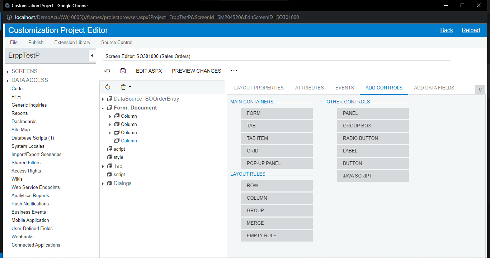
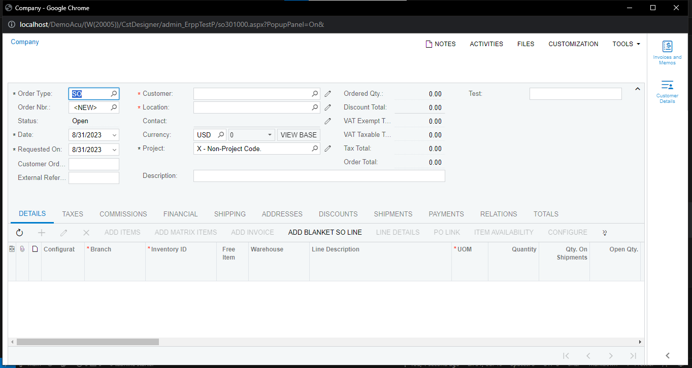

# Add Column From STD Form

1. Customization Projects > Add Row > Project Name (ErppTestP) > Save
   
   

2. Customization Project Editor > Screens> Customize Existing Screen (Sales Orders ["SO.30.10.00"]) > Ok
   

3. Form > Add Data Fields > New Field
   

4. set properties > Ok
   
   เลือก custom จะเห็นฟิลล์ที่เพิ่มเข้ามา (ต้อง publish ก่อนถึงจะใช้ได้)
   

5. Publish > Publish Current Project
   
6. Add Controls > ลาก Column ไปที่ Form > Save
   
   

7. click new column > Add Data Fields > select Field > Create Controls > Save
   
   

8. Preview Changes
   
   

9. Publish > Publish Current Project

10. open screen
    
    
