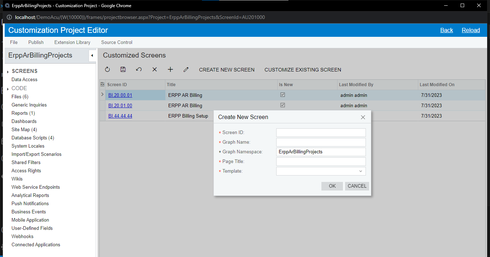

# FORM

> **สร้างฟอร์ม**

1. Customization Projects
   

2. Customization Project Editor > Screens > Create New Screen

   - Screen ID
   - Graph Name พื้นที่สำหรับเขียนโค้ด
   - Page Title
   - Template (ฟอร์มรูปแบบเริ่มต้น)
     
