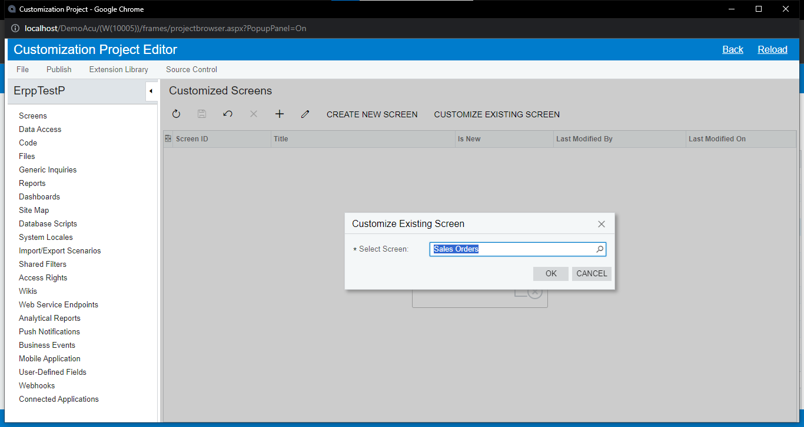
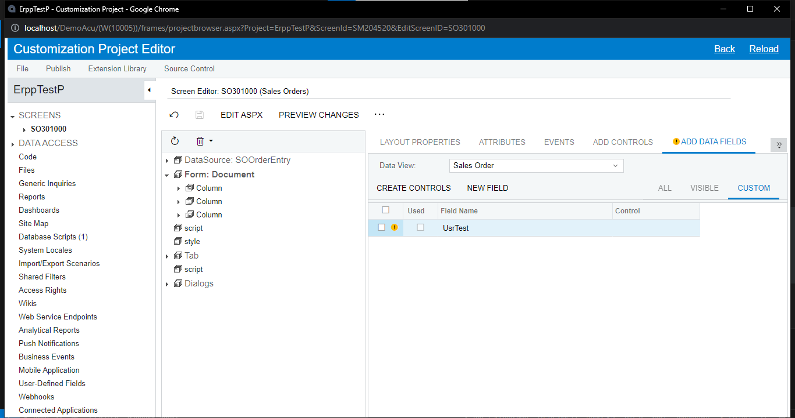
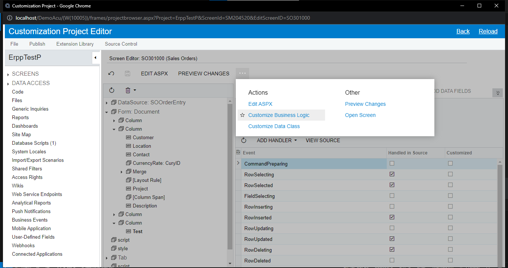
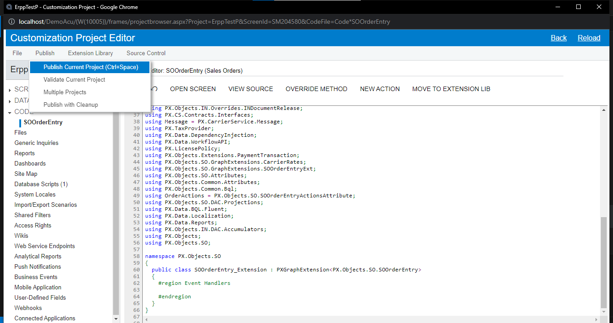
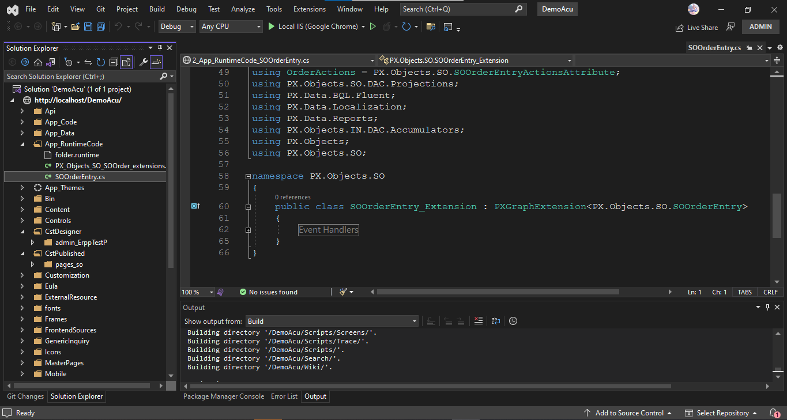
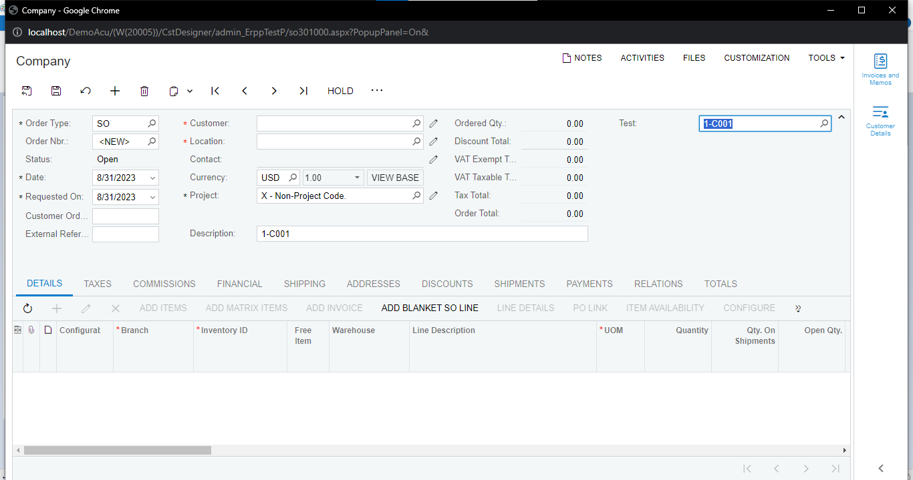
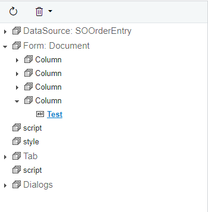
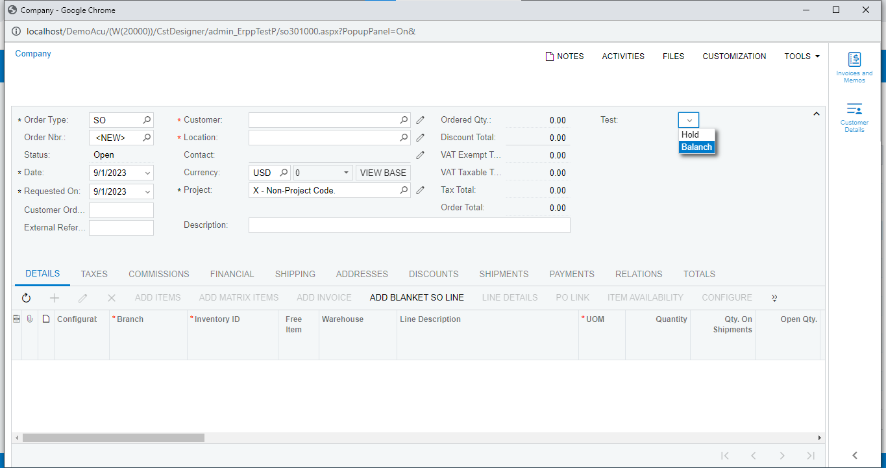

# Add Column From STD Form

> ### **Add Column**

1. Customization Projects > Add Row > Project Name (ErppTestP) > Save
   
   

2. Customization Project Editor > Screens> Customize Existing Screen (Sales Orders ["SO.30.10.00"]) > Ok
   

3. Form > Add Data Fields > New Field
   

4. set properties > Ok
   
   เลือก custom จะเห็นฟิลล์ที่เพิ่มเข้ามา (ต้อง publish ก่อนถึงจะใช้ได้)
   

5. Publish > Publish Current Project
   
6. Add Controls > ลาก Column ไปที่ Form > Save
   
   

7. click new column > Add Data Fields > select Field > Create Controls > Save
   
   

8. Preview Changes
   
   

9. Publish > Publish Current Project

10. open screen
    
    

# Action Componant

> ### **Action Data Change**

1. Customize Business Logic
   
   

2. Publish > Publish Current Project
   
   เมื่อ published จะเห็นไฟล์ graph ที่โฟลเดอร์ App_RuntimeCode
   

3. สร้างคลาสสำหรับฟิลล์ใหม่ที่ namespaces เดียวกัน และเซ็ต Selector สำหรับเลือกข้อมูลจาก Customer

   ```C#
   public class SOOrderExt : PXCacheExtension<PX.Objects.SO.SOOrder>
   {
    #region UsrTest
    [PXDBString(50)]
    [PXUIField(DisplayName = "Test")]
    [PXSelector(typeof(Search<Customer.acctCD>),
        typeof(Customer.acctCD),
        typeof(Customer.acctName))]

    public virtual string UsrTest { get; set; }
    public abstract class usrTest : PX.Data.BQL.BqlString.Field<usrTest> { }
    #endregion
   }
   ```

4. สร้าง Events สำหรับช่อง usrTest เปลี่ยนค่า ให้ไปอัปเดตที่ช่อง Description (OrderDesc) ที่ Form (เซ็ต Commit Change = True ที่ฟิลล์ Event)

   ```C#
   protected virtual void _(Events.FieldUpdated<SOOrder, SOOrderExt.usrTest> e)
   {
    var row = e.Row;
    var rowExt = e.Cache.GetExtension<SOOrderExt>(row);

    if (!string.IsNullOrEmpty(rowExt.UsrTest))
    {
        row.OrderDesc = rowExt.UsrTest;
    }
   }
   ```

   

5. result
   
   

> ### **Calculete in this Form - Other Form**

1. สร้าง Events สำหรับ grid details เมื่อ RowInserted ให้เอาช่่อง Quatity ไปอัปเดตที่ช่อง Description (OrderDesc) ที่ Form

   ```C#
   protected virtual void _(Events.RowInserted<SOLine> e)
   {
    var row = e.Row;

    decimal? qty = Base.Transactions.Select().FirstTableItems
        .Select(x => x.OrderQty).Sum();

    Base.Document.Current.OrderDesc = qty.ToString();
   }
   ```

2. result
   
   

3. calculate from DAC (แก้โค้ดจากข้อ 1)

   ```C#
   protected virtual void _(Events.RowInserted<SOLine> e)
   {
    var row = e.Row;

    //decimal? qty = Base.Transactions.Select().FirstTableItems
    //    .Select(x => x.OrderQty).Sum();
    SOOrderEntry graph = PXGraph.CreateInstance<SOOrderEntry>();

    if (row.OrderQty != null)
    {
        decimal? qty = 0;
        foreach (POOrder obj in PXSelect<POOrder>.SelectWindowed(graph, 1, 1))
        {
            qty = +(obj.CuryLineTotal * obj.CuryOrderTotal);
        }

        Base.Document.Current.OrderDesc = qty.ToString();
    }
   }
   ```

> ### **Create Link Form**

1. following code:

   ```C#
   public PXAction<SOOrder> TestLink;
   [PXButton(CommitChanges = true)]
   [PXUIField(DisplayName = "Action to Me",
    MapEnableRights = PXCacheRights.Select,
    MapViewRights = PXCacheRights.Select, Enabled = true, Visible = true)]
   protected virtual IEnumerable testLink(PXAdapter adapter)
   {
    if (Base.Document.Current?.OrderNbr != null)
    {
        SOOrderEntry graph = PXGraph.CreateInstance<SOOrderEntry>();

        graph.Document.Current = PXSelectReadonly<SOOrder,
            Where<SOOrder.orderNbr, Equal<Required<SOOrder.orderNbr>>>>
            .Select(graph, Base.Document.Current.OrderNbr);

        if (graph.Document.Current != null)
        {
            PXRedirectHelper.TryRedirect(graph, PXRedirectHelper.WindowMode.NewWindow);
        }
    }

    return adapter.Get();
   }
   ```

2. result
   

> ### **Combo Box**
* Fix Data
   1. UsrTest Field (delete userTest component)
      

   2. Edit Dac

      ```C#
      [PXDBString(50)]
      [PXUIField(DisplayName = "Test")]
      //[PXSelector(typeof(Search<Customer.acctCD>),
      //    typeof(Customer.acctCD),
      //    typeof(Customer.acctName))]
      [PXStringList(new string[] { "H", "B" }, new string[] { "Hold", "Balanch" })]
      public virtual string UsrTest { get; set; }
      public abstract class usrTest : PX.Data.BQL.BqlString.Field<usrTest> { }
      ```

   3. result
      
