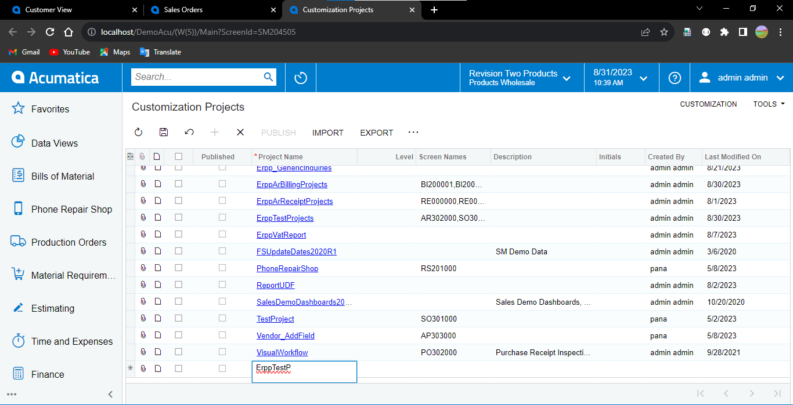
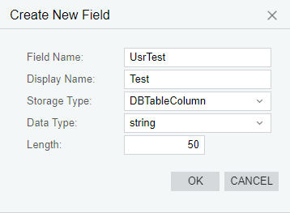
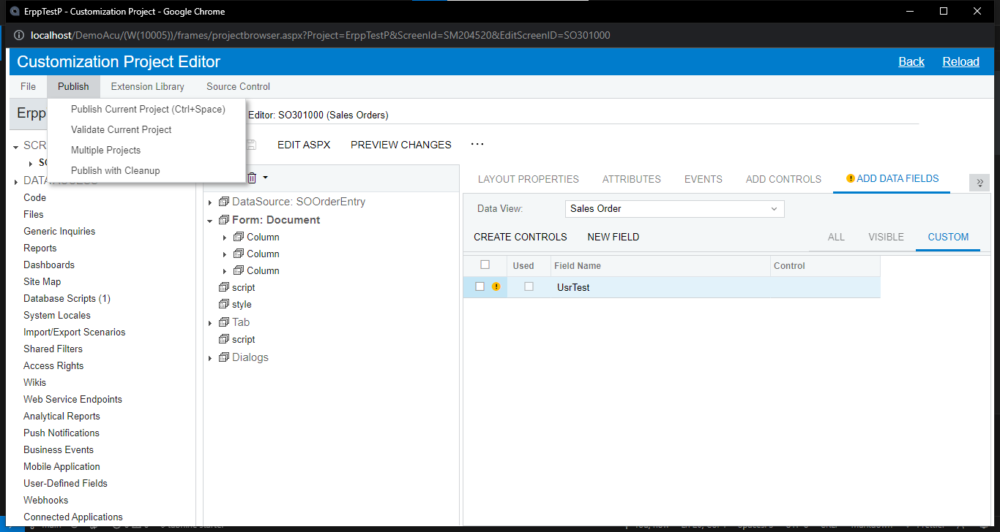
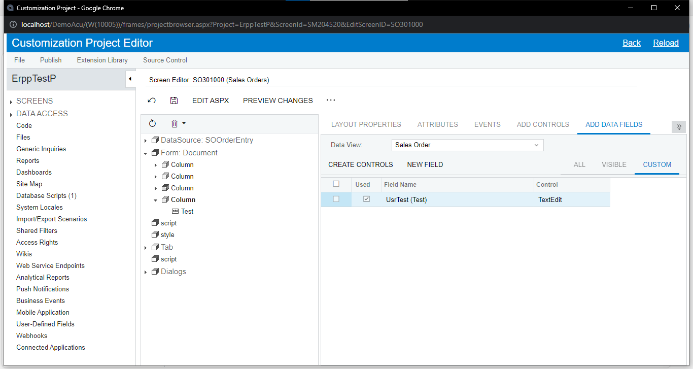
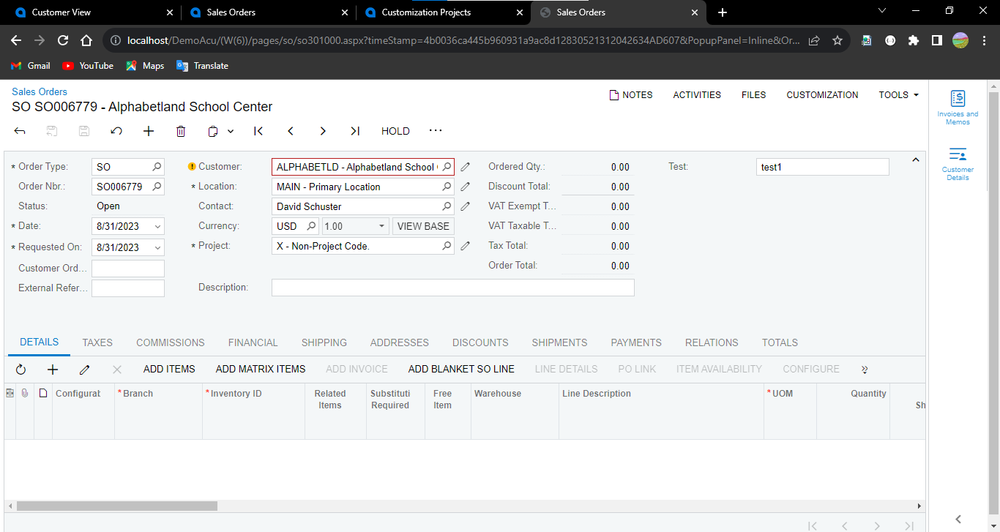

# Add Column From STD Form

> ### **Add Column**

1. Customization Projects > Add Row > Project Name (ErppTestP) > Save
   
   

2. Customization Project Editor > Screens> Customize Existing Screen (Sales Orders ["SO.30.10.00"]) > Ok
   

3. Form > Add Data Fields > New Field
   

4. set properties > Ok
   
   เลือก custom จะเห็นฟิลล์ที่เพิ่มเข้ามา (ต้อง publish ก่อนถึงจะใช้ได้)
   

5. Publish > Publish Current Project
   
6. Add Controls > ลาก Column ไปที่ Form > Save
   
   

7. click new column > Add Data Fields > select Field > Create Controls > Save
   
   

8. Preview Changes
   
   

9. Publish > Publish Current Project

10. open screen
    
    

# Action Componant

> ### **Action Data Change**

1. Customize Business Logic
   
   

2. Publish > Publish Current Project
   
   เมื่อ published จะเห็นไฟล์ graph ที่โฟลเดอร์ App_RuntimeCode
   

3. สร้างคลาสสำหรับฟิลล์ใหม่ที่ namespaces เดียวกัน และเซ็ต Selector สำหรับเลือกข้อมูลจาก Customer

   ```C#
   public class SOOrderExt : PXCacheExtension<PX.Objects.SO.SOOrder>
   {
    #region UsrTest
    [PXDBString(50)]
    [PXUIField(DisplayName = "Test")]
    [PXSelector(typeof(Search<Customer.acctCD>),
        typeof(Customer.acctCD),
        typeof(Customer.acctName))]

    public virtual string UsrTest { get; set; }
    public abstract class usrTest : PX.Data.BQL.BqlString.Field<usrTest> { }
    #endregion
   }
   ```

4. สร้าง Events สำหรับช่อง usrTest เปลี่ยนค่า ให้ไปอัปเดตที่ช่อง Description (OrderDesc) ที่ grapg extension

   ```C#
   #region Event Handlers
   protected virtual void _(Events.FieldUpdated<SOOrder, SOOrderExt.usrTest> e)
   {
    var row = e.Row;
    var rowExt = e.Cache.GetExtension<SOOrderExt>(row);

    if (!string.IsNullOrEmpty(rowExt.UsrTest))
    {
        row.OrderDesc = rowExt.UsrTest;
    }
   }
   #endregion
   ```

5. result
   
   
