# REPORT

> **เพิ่มรายงานที่ form**

1. Customization Projects
   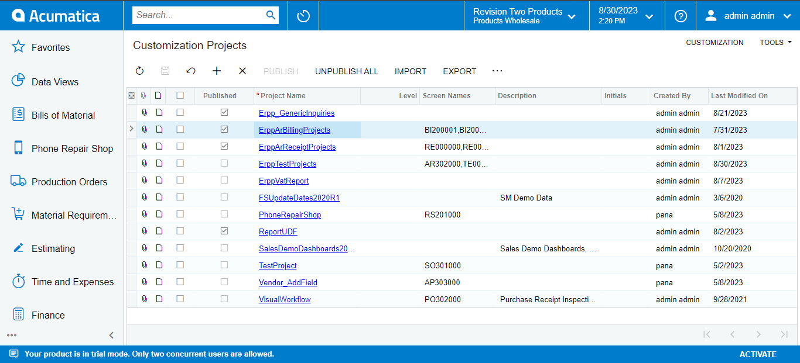

2. Customization Project Editor > Screens > Customize Existing Screen > เลือก screen ที่ต้องการแก้ไข
   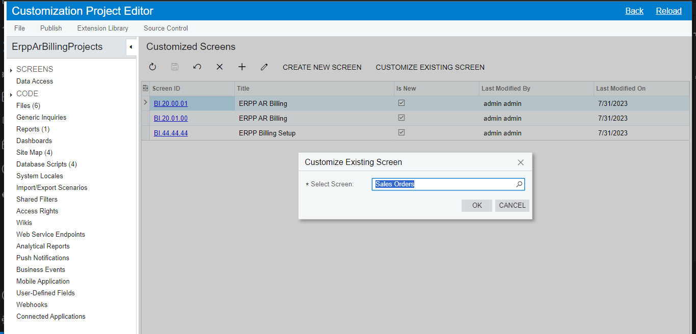

3. เลือก Customize Business Logic
   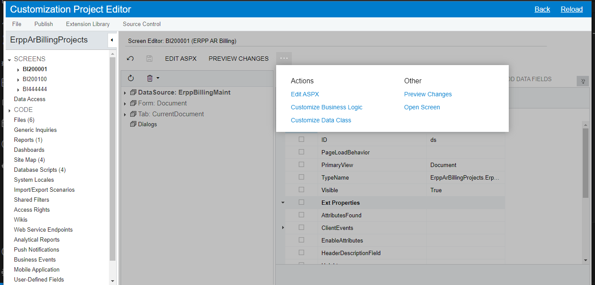
   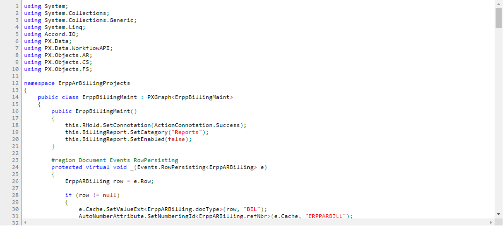

4. วางโค้ดด้านล่างลงไป (เพิ่มปุ่มลิงค์ไปที่หน้ารีพอร์ต โดยจะส่งค่า parameters จากหน้าฟอร์มไปรีพอร์ต)

   - PXAction\<ParentDAC\> **ดูจาก Data Class ของ Form (Ctrl+Alt+Left Click)**
   - ex = PXReportRequiredException.CombineReport(ex, **Screen ID ของ Report**, **parameters ของ Report**);

   ```c#
   #region Action BillingReport
       public PXAction<ErppARBilling> BillingReport;
       [PXButton(CommitChanges = true, SpecialType = PXSpecialButtonType.Report)]
       [PXUIField(DisplayName = "ERPP AR Billing Report", MapEnableRights = PXCacheRights.Select)]
       protected virtual IEnumerable billingReport(PXAdapter adapter)
       {
           PXReportRequiredException ex = null;
           foreach(ErppARBilling doc in adapter.Get<ErppARBilling>())
           {
               var parameters = new Dictionary<string, string>();

               parameters["RefNbr"] = doc.RefNbr;
               ex = PXReportRequiredException.CombineReport(ex, "BI200101", parameters);
           }
           if (ex != null) throw ex;

           return adapter.Get();
       }
       #endregion
   ```

   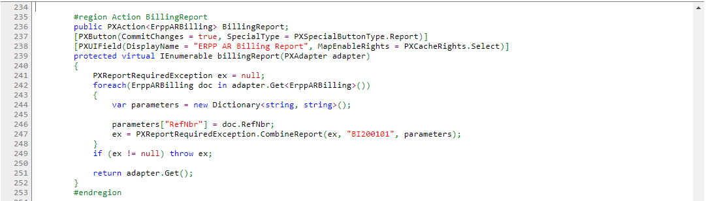
   Parent DAC
   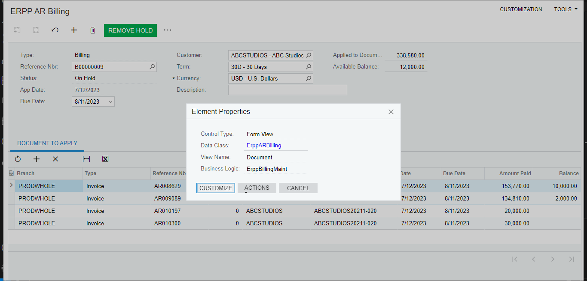
   Set Category ผ่านทาง constrctor ของ class นั้น
   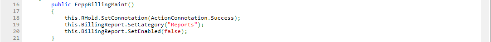

5. Publish > Publish Current Project
   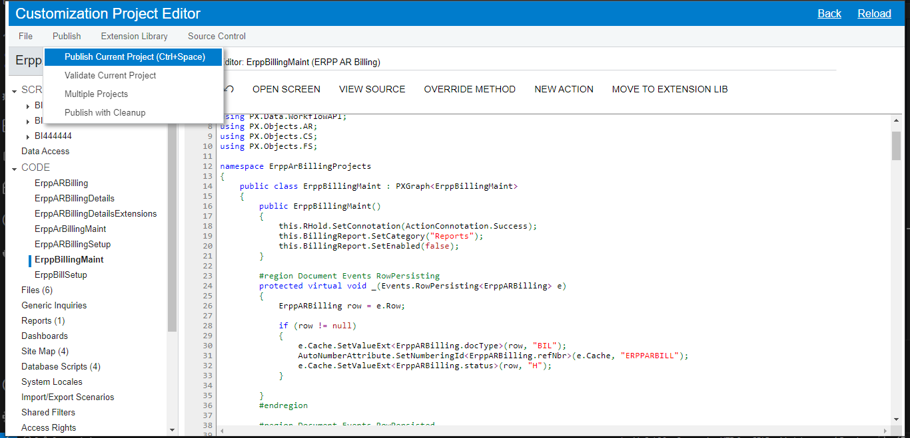

6. Result
   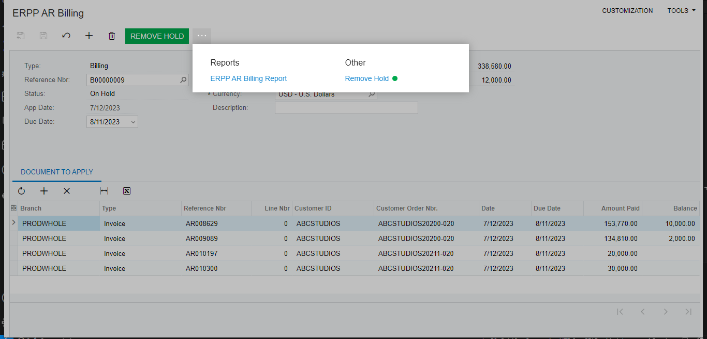

> **สร้างรายงาน**

1. Open Report Desginer
   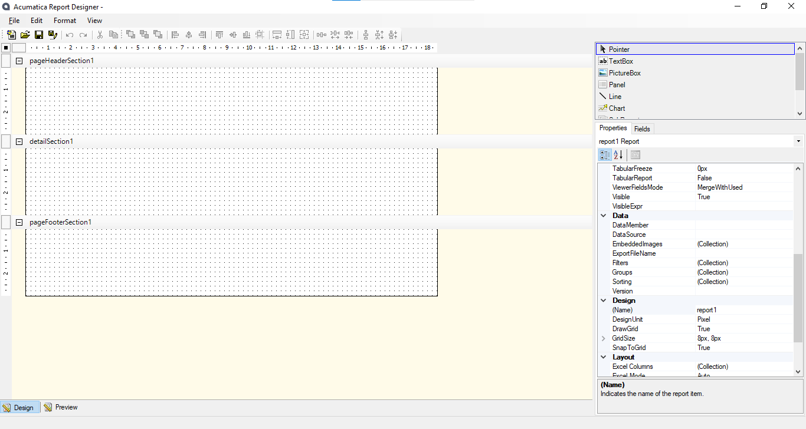

2. File > Build schema...

   Table
   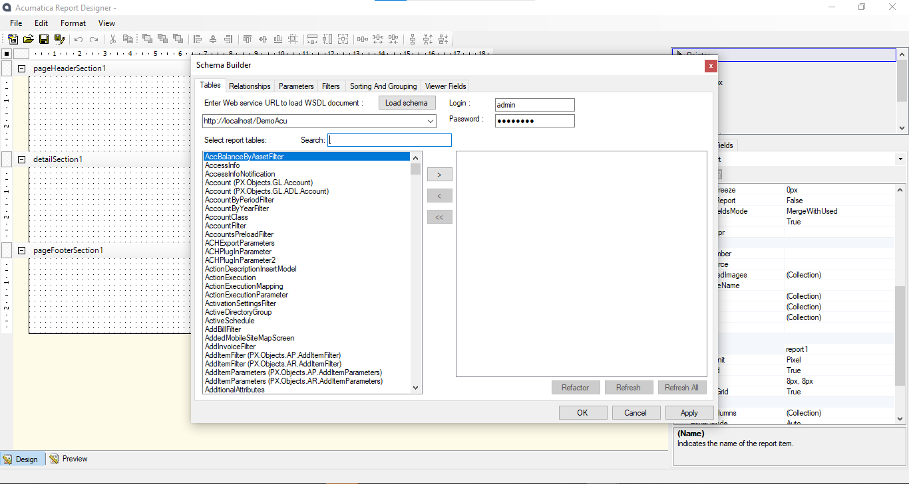
   Relationships
   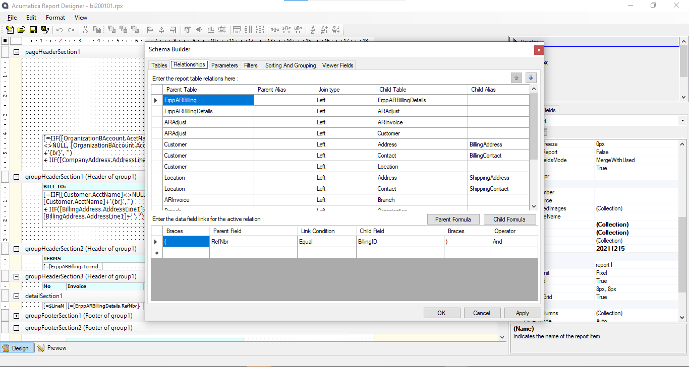
   Parameters (View Name จะแสดง Data Selector สามารถกำหนดได้จากฟิลด์ของ DAC ที่มี Selector Attributes)
   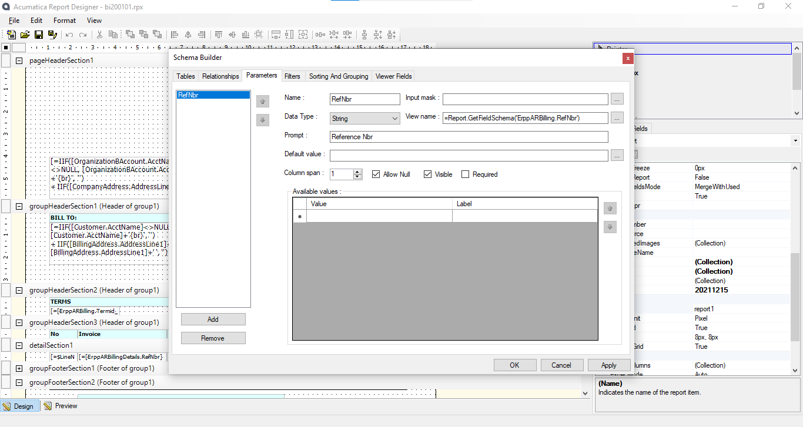
   Filters
   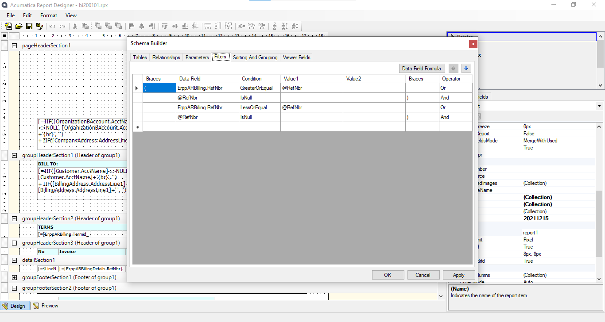

3. File > Save to Server
   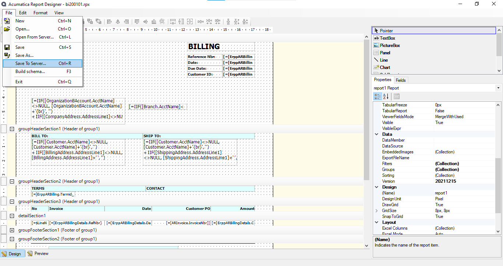
   กด Load reports list เช็คชื่อว่ามีหรือซ้ำไหม
   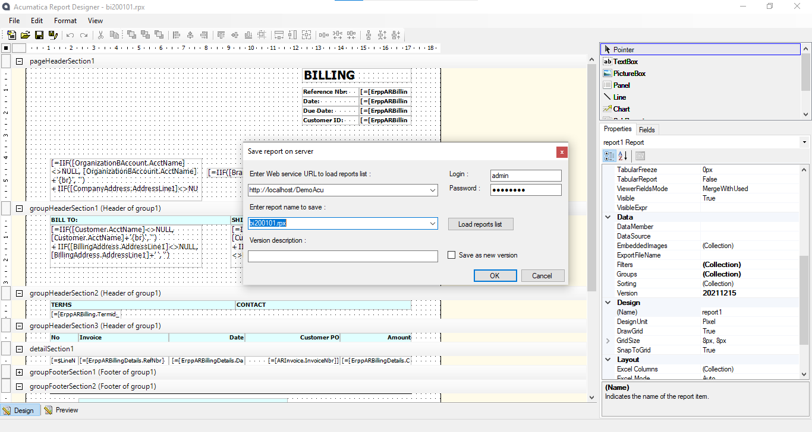

4. Open Site Map

- กำหนด Screen ID
- กำหนด Title
- Url ให้ ID เท่ากับชื่อไฟล์รีพอร์ตที่เราตั้งไว้
- WorkSpaces และ Category คือการกำหนดที่อยู่รีพอร์ต
  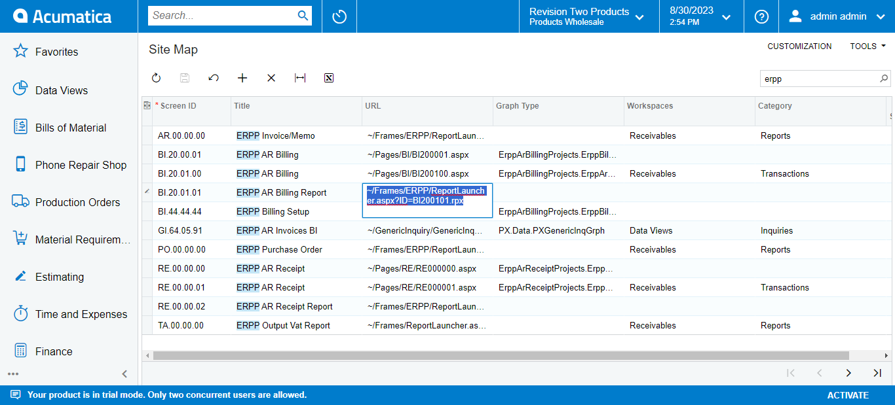

5. Save

6. หน้าเรีอกรีพอร์ต
   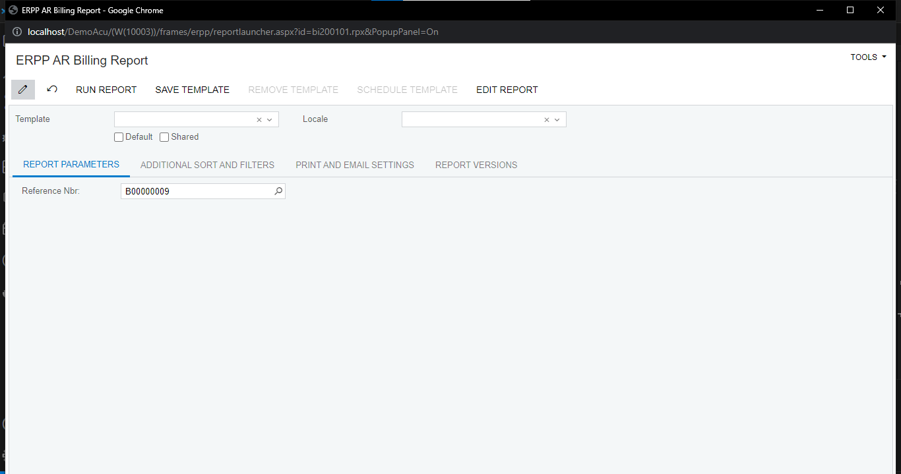
   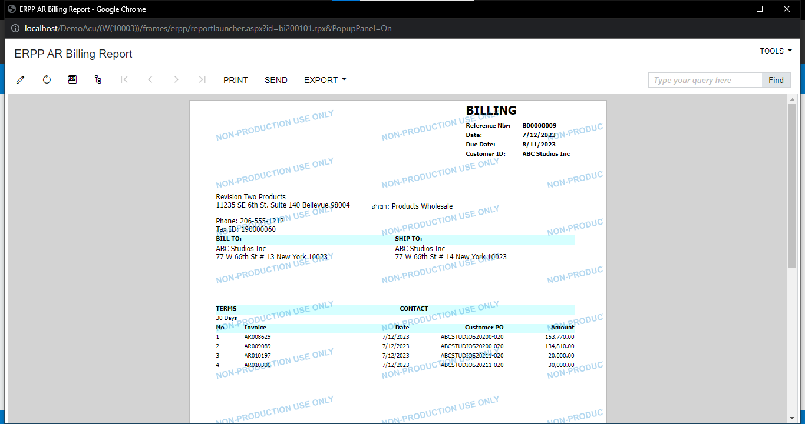

- ตัวอย่างลิงค์มากกว่าหนึ่งรีพอร์ต
  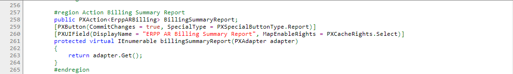
  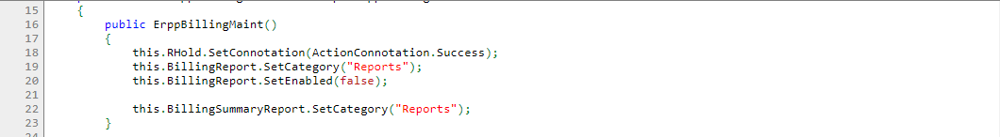
  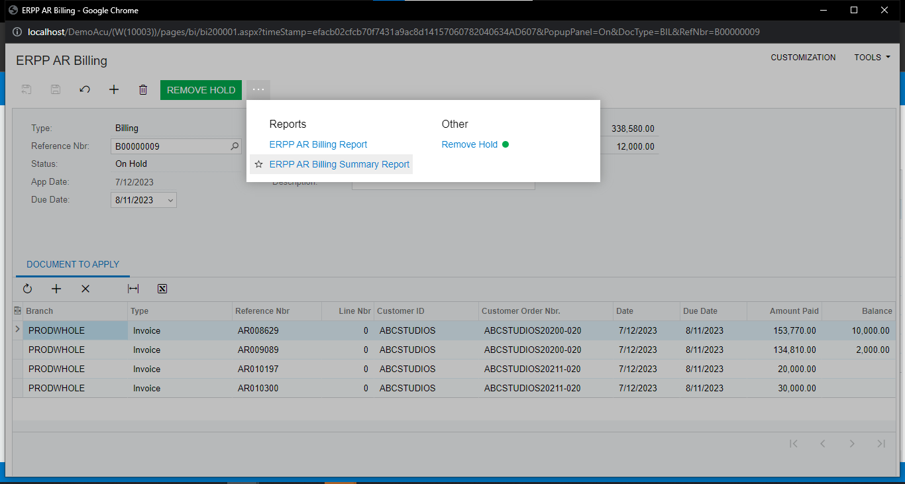
